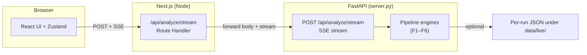

# Incident Copilot

A web console for incident response: paste raw logs and walk through **triage → hypotheses & RCA → evidence → action plan → executive summary → code optimization hints** in one flow. The stack is a **Next.js** frontend and a **Python (FastAPI)** backend; live analysis streams stage-by-stage over **Server-Sent Events (SSE)**.

## Features

| Stage | Description |
|------|-------------|
| **Triage** | Initial classification and severity from logs |
| **Hypothesis / RCA** | Ranked cause hypotheses and root-cause analysis |
| **Evidence** | Structured supporting evidence |
| **Action plan** | Runnable runbook steps with HITL gates |
| **Executive summary** | Role-aware briefings (e.g. SRE vs executive) |
| **Optimization** | Hints for related code or configuration |

Demo and integrated scenarios live under `data/` and `frontend/mocks/` (see [Data sources](#data-sources)). Each live run can also persist per-stage JSON under `data/live/<run_id>/` for an audit trail aligned with the feature-split format the UI loaders expect.

## Prerequisites

- **Node.js** 20+ (frontend)
- **Python** 3.10+ (backend)

## Quick start

### 1. Backend (FastAPI, SSE)

```bash
cd backend
pip install -r requirements.txt
uvicorn server:app --reload --port 8000
```

- Streaming endpoint: `POST /api/analyze/stream`
- Health: `GET /health`

### 2. Frontend (Next.js)

In a second terminal:

```bash
cd frontend
npm install
npm run dev
```

Open [http://localhost:3000](http://localhost:3000). By default, the Next.js route `/api/analyze/stream` proxies to the FastAPI server at `http://localhost:8000`.

### Environment variables

| Variable | Purpose | Default |
|----------|---------|---------|
| `INCIDENT_COPILOT_BACKEND_URL` | FastAPI base URL (used by the Next.js server-side proxy) | `http://localhost:8000` |

Set this in deployment so the browser keeps same-origin access to SSE while the app server talks to your API.

## Repository layout

```
backend/          # Engine modules + FastAPI app (live SSE)
frontend/       # Next.js app, UI, adapters, API routes
data/           # Sample scenario / per-feature JSON
prompts/        # Prompt-related assets
```

## Data sources

Sample log data used for demos and integrated scenarios in this repository comes from **[LogHub](https://github.com/logpai/loghub)** ([`logpai/loghub`](https://github.com/logpai/loghub)), a large collection of system log datasets for AI-driven log analytics (LogPAI; see the upstream repo for the ISSRE’23 reference and citations). Use and redistribution of that material are subject to **LogHub’s own license and terms**—check the [LogHub repository](https://github.com/logpai/loghub) before republishing or building on the raw datasets.

## Frontend scripts

- `npm run build` — production build
- `npm run lint` — ESLint

## Architecture

### System overview

The browser only talks to the **Next.js** app. The app’s **Route Handler** at `/api/analyze/stream` forwards the client’s POST to **FastAPI** and pipes the SSE stream back unchanged. That avoids CORS in the browser, keeps a single place for auth or rate limits later, and works cleanly behind hosts like Vercel.



### Pipeline stages (backend)

For each analyze request, the live server runs the engines in a fixed order and emits one SSE `stage` event after each step:

1. **Triage** — `incident_triage` (`incident_triage_poc`)
2. **RCA** — `AdvancedRCAEngine`
3. **Evidence** — `EvidenceNormalizer` (normalized items for the UI)
4. **Action plan** — `ActionPlanEngine` (plan + safety evaluation)
5. **Summary** — `ExecutiveSummaryEngine` (SRE and Executive markdown in one payload)
6. **Optimization** — `CodeOptimizationEngine` (omitted from the stream when there is nothing to show; the UI hides the card)

The UI maps each payload through **adapters** (`frontend/lib/adapters/`) into a consistent view model consumed by cards (triage, hypotheses, evidence, actions, summary, optimization).

### Data paths

- **Integrated / mock mode**: JSON under `data/` or `frontend/mocks/ui/` is loaded by adapters for demos without a running backend. Underlying log samples are attributed in [Data sources](#data-sources).
- **Live mode**: the FastAPI stream drives the UI; intermediate JSON may be written under `data/live/<run_id>/` for debugging and parity with the split file layout.

### License

No `LICENSE` file is included in this repository. Confirm terms with your organization before use or distribution.
